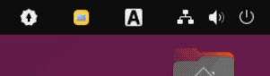

# Ubuntu용 DKST 한국어입력기

Linux 환경을 위한 IBus 기반 한글 입력기 엔진입니다.

## 주요 기능

*   **모아치기 지원**: 자음과 모음을 빠르게 동시에 입력해도 정확하게 처리합니다.
*   **커서 위치 기반 한/영 상태표시**: 입력 상태에서 한/영 전환 표시를 옵션에서 선택할 수 있습니다.
*   **유연한 한영 전환**: Shift+Space, Ctrl+Space 등 원하는 키 조합을 마음대로 설정할 수 있습니다.
*   **gnone-shell 확장프로그램**(옵션): 한/영 인디케이터를 지원합니다.
*   **한자/사용자 사전 변환**: Alt+Return으로 한자 변환, 사용자 정의 단어 변환 지원
*   **단어 단위 변환**: "대한민국" → "大韓民國" 처럼 여러 글자 단어도 변환 가능
*   **사전 편집기**: GUI로 사용자 사전을 쉽게 추가/편집/삭제
*   **단자음/단모음 커스텀화**: 단자음/단모음을 사용자가 원하는 문장이나 이모지 등으로 설정할 수 있습니다.
*   **백스페이스 모드**: 글자 단위 삭제와 자소 단위 삭제 모드를 지원합니다.
*   **편리한 설정**: 직관적인 GUI 설정 도구를 제공합니다.

## 설치 방법

### A, B, C 중 하나의 방법을 선택하여 설치합니다. ###

### A. 단순 DEB 패키지 설치
ibus-dkst_1.0_amd64.deb를 더블클릭하여 설치합니다.

### B. 소스 코드 설치
터미널에서 `install.sh` 스크립트를 실행하면 컴파일부터 설정까지 자동으로 진행됩니다.

```bash
cd DINKIssTyle-IME-Ubuntu
chmod +x install.sh
./install.sh
```

### C. DEB 패키지 빌드 및 설치
데비안 패키지(.deb)로 만들어서 설치하고 싶으다면 다음 명령어를 사용하세요.

```bash
chmod +x build_deb.sh
./build_deb.sh
sudo dpkg -i ibus-dkst_1.0_amd64.deb
```

### 옵션1. gnone-shell 확장프로그램
<div align="center"><br><br></div>
SVG 이미지 기반 효과적인 한/영 전환상태를 시스템트레이에서 보기 위해서 다음 명령어를 사용하세요.

```bash
cd gnome-extension
./install.sh
```

설치 후 로그아웃 후 다시 로그인 하고 다음 명령어를 사용합니다.

```bash
gnome-extensions enable dkst-indicator@dinkisstyle.com
```

## 사용 방법

*   **설정 > 지역 및 언어 > 입력 소스** 메뉴에서 `한국어 (DKST)`를 추가해주세요.

## 정보

(C) 2025 DINKI'ssTyle
